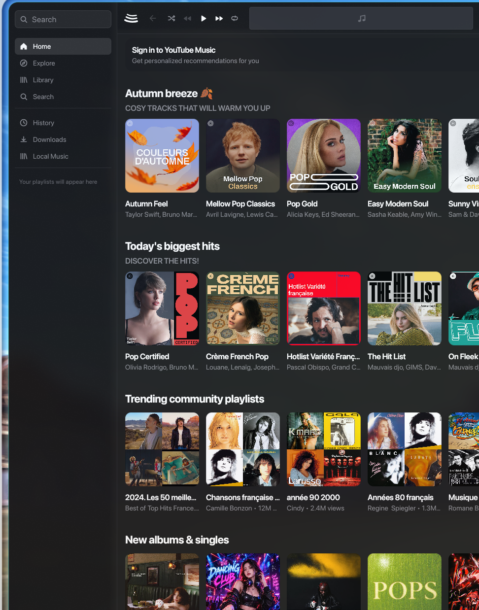

# bitchord-bin

AUR package for [BitChord](https://github.com/kushagrasinghx/BitChord) — a modern YouTube Music client with clean aesthetics inspired by Apple Music.

Installs the prebuilt `jpackage` image (self-contained, bundled Java runtime) from the upstream `.deb` release asset. Works on any desktop: GNOME, KDE, Hyprland, Sway, i3, …



```sh
paru -S bitchord-bin
```

Launch with `bitchord` or from your app menu.

## Single instance

The upstream `jpackage` launcher has no activation mechanism, so launching it
twice would run two copies. The packaged `/usr/bin/bitchord` wrapper prevents
that: if an instance is already running it exits, focusing the existing window
where the compositor allows it (Hyprland), or notifying you otherwise
(`libnotify`).

## HiDPI / Wayland scaling

The app is a Compose Desktop (AWT) application, so it runs through **XWayland**.

- **GNOME / KDE**: your desktop scales XWayland itself — the wrapper stays out
  of the way. On KDE Wayland the wrapper can additionally detect the monitor
  scale via `kscreen-doctor` (`kscreen` package) and pass it to the app for a
  sharper native render.
- **Compositors without XSettings** (Hyprland, Sway, …): the wrapper detects
  the focused monitor's scale (`hyprctl`/`swaymsg`, fractional scales like
  1.25 supported) and passes it to the JVM as `-Dsun.java2d.uiScale`, so the UI
  is drawn at the correct size. Without this the app would render at scale 1
  and get upscaled.
- **Manual override** on any desktop:
  `JAVA_TOOL_OPTIONS=-Dsun.java2d.uiScale=1.5 bitchord` (or set `GDK_SCALE`).
  User-set variables always take precedence over the wrapper.

On compositors **without** XSettings, XWayland buffers are additionally
upscaled by the compositor unless zero scaling is forced. For a pixel-perfect
render, enable it once in your compositor config:

- Hyprland: `xwayland { force_zero_scaling = true }`
- Sway: `xwayland enable` renders 1:1 by default; no extra step needed.

Without it, sizes are still correct (the wrapper handles that) but the
compositor's upscale leaves the render slightly soft.
